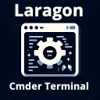

# Laragon Cmder Terminal Config (Windows)

# Laragon Terminal Config

A VS Code extension **[Laragon Cmder Terminal Config (Windows)](https://marketplace.visualstudio.com/items?itemName=azmolla.laragon-terminal-config)** that configures the integrated terminal on Windows to use Laragon's Cmder, with a customizable executable path and an option to set it as the default terminal.

## Features

- **Custom Terminal Profile:** Automatically configures a terminal profile for Laragon Cmder.
- **Settings Integration:**  
  - **laragonTerminalConfig.laragonPath:** Set the path to your Laragon Cmder executable.  
    _Default: `${env:windir}\\System32\\cmd.exe`_
  - **laragonTerminalConfig.setAsDefault:** Choose whether to set Laragon as the default terminal.  
    _Default: `true`_
- **Command Palette:** Run the command **Set Laragon Terminal as Default** to update your terminal configuration manually.

## Installation

1. **Install via Marketplace**:
   - Open Visual Studio Code or VSCodium.
   - Go to the Extensions view by clicking on the Extensions icon in the Activity Bar.
   - Search for **Laragon Cmder Terminal Config (Windows)** and click **Install**.

   Or visit the extension [on the VSCode Marketplace](https://marketplace.visualstudio.com/items?itemName=azmolla.laragon-terminal-config) or [on the Open VSX Marketplace](https://open-vsx.org/extension/azmolla/laragon-terminal-config).